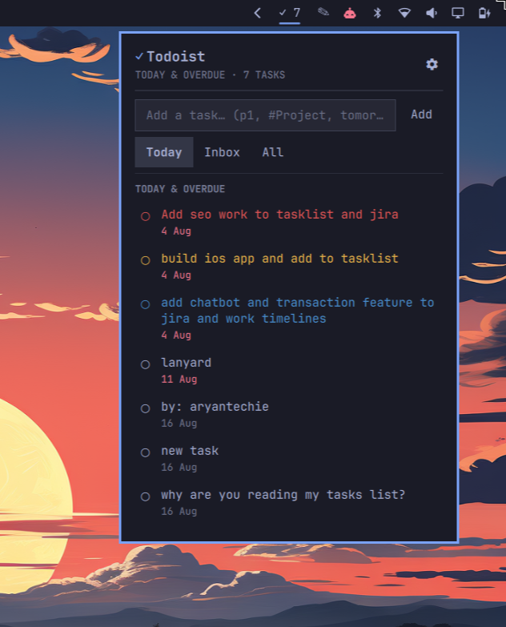

# Pre-publish checklist

Tracks what's done and what's left before submitting to
[omarchyplugins.com](https://omarchyplugins.com/). See
[roadmap.md](roadmap.md) for feature direction beyond this gate.

## Marketplace requirements (from the publishing guide)

- [x] Public GitHub repository — `aryan-techie/omarchy-todoist`
- [x] Valid `manifest.json` in the repo root (`omarchy plugin validate` passes)
- [x] README
- [x] License (MIT)
- [x] Safe install — no destructive/unexpected system changes on enable
- [x] Safe removal — documented what `omarchy plugin remove` does and
      doesn't clean up (state file, optional keybind line)
- [x] Preview image (`preview.png`) — captured, shown in README

      

## Functional verification

- [x] `omarchy plugin validate` passes
- [x] Loads with no QML errors on the live shell (`qs log`)
- [x] Enabled, placed on the bar, confirmed via `omarchy plugin list --json`
- [x] Real Todoist token saved and working — user confirmed tasks load
- [x] Token file created at `chmod 600` — verified on disk
- [x] Fixed a real binding-loop bug in the header layout caught by watching
      `qs log` during dev testing (Math.max-of-two-children's-implicitHeight
      + anchoring a child back to the parent's own computed height)
- [ ] Complete a real task end-to-end (click the circle, confirm it strikes
      through/dims briefly then disappears, and completes in Todoist itself)
- [ ] Quick-add a real task end-to-end (confirm it shows up in Todoist)
- [ ] Exercise all three quick-view tabs (Today, Inbox, All) with a real
      account that has tasks in more than one place
- [ ] Set the Ctrl+Super+Y shortcut from Settings and confirm it toggles the
      panel; confirm `bindings.lua.bak.*` backup appears and `hyprctl
      configerrors` stays empty
- [ ] Record a custom shortcut, confirm it applies and the old one no longer
      does anything
- [ ] Remove the shortcut from Settings, confirm the `o.bind` line is gone
      from `bindings.lua`
- [ ] Disable → re-enable the plugin, confirm state (token, filter, quick
      view, shortcut) survives
- [ ] `omarchy-shell shell restart`, confirm everything still works cold
- [ ] Remove the plugin (`omarchy plugin remove`), confirm the bar icon
      disappears cleanly and nothing else breaks
- [ ] Test with an invalid/expired token — confirm the error message in
      Settings is clear ("Todoist rejected the API token…")
- [ ] Test with no network — confirm the error message is clear ("Couldn't
      reach Todoist…")
- [x] Confirmed the panel drops directly below the bar icon (`centerOnBar:
      false`), not centered on the whole bar
- [x] Verified live in `qs log` after the v1.2 keyboard/visual rework —
      only the known benign binding-loop class below, no new warnings, no
      JS errors
- [ ] Walk the full keyboard path with no mouse: open via shortcut → Tab
      through Today/Inbox/All → arrow through tasks → Enter to complete →
      `r` to refresh → Escape → Escape to close
- [x] v1.10: Tab/Shift+Tab and the arrow keys now walk every Settings
      control in order instead of falling through to bar-panel switching —
      confirmed via screenshots that Tab correctly skips the disabled "Save
      token" button and lands on "Remove token," and that the Flickable
      scrolls to keep the focused control in view as focus moves deeper into
      the list.
- [ ] Confirm typing in the token/filter/quick-add fields, or recording a
      shortcut, isn't disrupted by the new `r`/arrow/Tab handlers (the
      `blocked` guard should suspend them all while a field has focus)
- [x] Found and fixed a real bug via user report: quick-add auto-focused on
      every panel open, which silently blocked every v1.2 shortcut (arrows,
      Tab, r) since they're suspended whenever a text field has focus. Fixed
      in v1.3 — panel only steals focus into a field when opening straight
      into Settings.
- [ ] Quick-add: type a bare task ("Buy milk"), confirm it lands due today
      in Todoist
- [ ] Quick-add: type `p1` (and `#Project`, `@label` if you have real ones),
      confirm Todoist applied them
- [ ] Quick-add: type an explicit date ("Buy milk tomorrow"), confirm the
      auto-appended "today" heuristic did NOT also get added (should be due
      tomorrow, not today)
- [ ] Press `q` from the task list, confirm focus lands in the quick-add box
- [ ] Arrow to a task, press `x`, confirm the confirm dialog shows the right
      task title, **Escape**/click-Cancel backs out without deleting, and
      confirming actually deletes it in Todoist
- [ ] Arrow to a task, press `Enter`, confirm it opens that exact task on
      app.todoist.com in your browser (and does **not** also complete it)
- [ ] Arrow to a task, press `Space`, confirm it completes (and does **not**
      open a browser tab)
- [ ] Arrow to a task, press `e`, edit the text, press `Enter`, confirm the
      new title shows immediately and persists in Todoist after a refresh
- [ ] Press `e` on a task, press `Escape` instead of `Enter`, confirm the
      original title is unchanged
- [ ] Complete two tasks in quick succession, confirm both eventually
      disappear (the removal delay batches to the last click, which is fine)
      and neither gets stuck showing struck-through forever
- [ ] Press `t`/`i`/`a` from the task list, confirm each jumps straight to
      that view (same as clicking the tab)
- [ ] Press `p` from the task list, confirm Settings opens; press `p` again,
      confirm it closes back to the task list (not just Escape's one-way
      back-out)
- [ ] Focus the Add-a-task box, type something, press `Escape`, confirm it
      only leaves the box (focus returns to normal keyboard nav) and does
      **not** close the panel or clear what you typed
- [x] Reproduced and fixed the reported overflow bug on the All view (24
      tasks): the "Loading…" row was rendering below an already-populated
      list during background refreshes, pushing content past the card's
      bounds. Loading now only shows on an empty list; also added a
      `clip: true` safety net on the panel's key handler.
- [ ] Switch to All with 20+ tasks, wait through a background refresh (or
      trigger one with `r`), confirm nothing visibly overflows past the
      card's rounded border regardless of scroll position
- [ ] Press `Enter` on a task, confirm the browser opens AND the panel
      closes (not just the browser opening)
- [ ] Press `?` (or **Keyboard shortcuts** in Settings → General), confirm
      the shortcuts overlay opens/closes; confirm `Escape` and `?` both
      close it without closing the whole panel
- [x] Reproduced and fixed a second overflow bug (screenshot: the `?`
      overlay itself) — text ran past the card's border because
      `BorderSurface.padding` isn't auto-applied to children; fixed by
      adding the missing content-inset margins (matching
      `Ui/ConfirmDialog.qml`'s own working pattern) and widening the card.
- [ ] Open the `?` overlay, confirm all 12 shortcut lines are fully inside
      the bordered card with real padding on every side, none touching or
      crossing the border
- [ ] Confirm the header now shows only the gear icon (↻ and "?" removed)
- [ ] Open Settings, confirm four labeled sections (Account, Default
      filter, Keyboard shortcut, General) render cleanly with no overlap
- [ ] Click **Refresh now** in Settings → General, confirm it shows
      "Refreshing…" and re-disables itself briefly, then goes back to
      "Refresh now" — this was the concrete fix for "refresh doesn't feel
      like it's working"
- [ ] Type a filter in Settings → Default filter and click **Apply** (not
      just pressing Enter), confirm it switches the task list to that filter
- [x] Switch between Today/Inbox/All and Settings repeatedly, confirm the
      popup window itself never visibly resizes — only its scrollable
      content changes. Verified directly with `grim` screenshots + `wtype`
      to switch views programmatically: the card's border sits at identical
      pixel coordinates in both a sparse (6-task) and dense (26-task) view.
      What read as "resizing" was the dense view filling the same fixed box
      edge to edge versus visible empty space in the sparse one — not an
      actual dimension change.
- [ ] Settings → Advanced: click `W +`/`W −` and `H +`/`H −` a few times,
      confirm the popup visibly resizes immediately and the new size sticks
      after closing/reopening the panel (persisted to settings.json)
- [ ] Confirm the gear icon (⚙ → 󰒓) renders as a proper filled gear glyph,
      not a missing-character box — if it renders as a box, the active font
      doesn't have this Nerd Font codepoint and the icon should revert to
      plain `⚙`
- [ ] Find (or set, via `p1`/`p2`/`p3` in quick-add) tasks at each priority
      level, confirm they render red/yellow/blue respectively and a
      no-priority task stays the normal text color
- [ ] **v1.11**: On the Today view with at least one overdue task and one
      due-today task, confirm two separate headers render (**OVERDUE · N**
      and **TODAY · N**, each with its own separator above it) with correct
      counts, and each task lands under the right one. With only one group
      present (all overdue, or none overdue), confirm only that group's
      header shows — no empty "OVERDUE · 0"/"TODAY · 0" block. Confirm
      Inbox/All/Custom Filter are unchanged (single generic header, no
      split). Confirm arrow-key/`j`/`k` cursor movement and Enter/Space/`e`/
      `x` on a task still work correctly across the section boundary.
- [x] Position-shift issue (Today ↔ Inbox/All, panel left open) — user
      confirmed v1.9.1's fix resolved it.
- [ ] **User to re-test**: confirm the quick-add field and the
      Today/Inbox/All tabs now feel properly spaced from the panel's edges,
      not cramped against the border. v1.9.2's `clip: true` (defensive,
      unconfirmed) turned out not to be the real fix — the user clarified
      nothing was shifting, it was just insufficient padding around the
      whole panel. v1.9.3 bumped `KeyboardPanel`'s padding 14px → 20px.
- [ ] **User to re-test (v1.10, visual only — not re-verified by
      screenshot this round per the user's own request)**: confirm
      Settings → Advanced now renders as two vertically stacked bordered
      blocks (Width, then Height), each with its label and `−`/`+` steppers
      inside one bordered card, matching the General section's block style —
      and that Tab/arrow navigation still lands correctly on all four
      stepper buttons.

## Known, accepted issues

- Benign `Binding loop detected for property "height"` warnings in `qs
  log`, from the `height: visible ? implicitHeight : 0` pattern on the
  loading/empty-state `Text` rows and the new `PanelSectionHeader` above the
  list. Confirmed this exact warning class already exists in Omarchy's own
  shipped `bluetooth` panel (`PanelSectionHeader`), so it's a known Qt Quick
  engine quirk in this environment, not a functional bug — cosmetic log
  noise only, does not affect behavior. Left as-is rather than restructuring
  further.
- The Settings gear icon (`󰒓`) is a Nerd Font Private Use Area codepoint with
  no verified runtime fallback, and this is accepted rather than fixed.
  Investigated 2026-08-16: the shell's `Style.fontFamily` is bound to
  `"monospace"`, a fontconfig alias that `omarchy font set` can repoint to
  *any* installed font — `Style.qml`'s own comment only says it *currently*
  resolves to "e.g. JetBrainsMono Nerd Font," not that it's guaranteed to.
  Checked whether Quickshell/QML exposes a "does this font have this
  codepoint" runtime check to build a real fallback with — it doesn't,
  without dropping into C++, and nothing in the built-in shell (including
  the notifications panel's own glyph-fallback code) does this either; every
  built-in use of a Nerd Font glyph makes the same unverified assumption.
  Decision: keep `󰒓` as-is rather than build one-off detection this plugin
  would be the only thing in the shell attempting. If it ever renders as a
  missing-character box on a real system, the fix is a one-line revert to
  plain `⚙` (already noted above) — not a new mechanism.

## Functional verification — v1.12 Advanced Task Editing (Shift+Q)

- [ ] Select a task, press `Shift+Q` (not `q`, which still just focuses
      Add-a-task): the full editor opens over the task list with title
      pre-filled, correct priority button highlighted, due field showing
      the task's current due string (or empty if none), project dropdown
      showing its current project, labels multiselect showing its current
      labels.
- [ ] `Tab`/`Shift+Tab` walks every field in order (title → P1–P4 →
      due → Clear due date → project → labels → Save → Cancel) with no
      dead spots and no landing on a disabled control.
- [ ] Change only the title, press `Enter` from the title field: confirm it
      saves (shows "Saving…" briefly, editor closes, row updates) and
      nothing else about the task changed.
- [ ] Change priority via the P1–P4 buttons, save, confirm the row's
      priority color updates and it's reflected in Todoist after a refresh.
- [ ] Change the due field to something like "tomorrow at 5pm", save,
      confirm Todoist parsed it the same way quick-add would.
- [ ] Click **Clear due date**, save, confirm the task has no due date in
      Todoist afterward (this exercises the unverified `due_string: "no
      date"` assumption — if it does NOT clear the date, that's the one
      thing in this feature that needs a follow-up fix).
- [ ] Change the project via the dropdown, save, confirm the task actually
      moved to that project in Todoist (this is the separate `/move` call —
      worth confirming it fires correctly alongside or instead of the
      Update call as appropriate).
- [ ] Add and remove labels via the multiselect, save, confirm both stick
      in Todoist.
- [ ] Change several fields at once (title + priority + due + project +
      labels together), save, confirm all of them landed correctly.
- [ ] Open the editor, change nothing, press `Escape`: confirm it closes
      with no API call and no change to the task.
- [ ] Open the editor, change the title, press `Escape` (not Save): confirm
      the edit is discarded — task unchanged in the list and in Todoist.
- [ ] Clear the title field entirely and try to save: confirm it's blocked
      with an inline "Title can't be empty" error, not silently accepted.
- [ ] With the project dropdown or labels multiselect *open* (popup
      expanded), confirm arrow keys/`j`/`k` navigate its options (not the
      outer form) and `Enter`/`Space` selects without closing the whole
      editor; `Escape` closes just the popup, not the editor.
- [ ] Confirm the existing lightweight `e` inline title edit still works
      exactly as before — this feature was built specifically not to touch
      it.
- [ ] Disconnect network (or use an invalid token) and try to save a
      change: confirm the error shows inline in the editor, the editor
      stays open (edits aren't lost), and Save is usable again afterward
      once the state clears.
- [ ] Confirm the project dropdown and labels multiselect actually populate
      with your real projects/labels (fetched once per panel session) —
      if either shows empty, check for a `GET /projects` or `GET /labels`
      error in `qs log`.

## Before hitting submit

- [ ] Work through the "Functional verification" list above with the live
      account
- [x] Decide on `preview.png` — captured, in repo root and README
- [ ] Re-read README top to bottom as a first-time installer would
- [ ] Bump `manifest.json` version if anything changes after this point
- [ ] Open the submission issue from the omarchyplugins.com page (repo link,
      category, tags) — not something I can do on your behalf since it's
      your GitHub account submitting it
